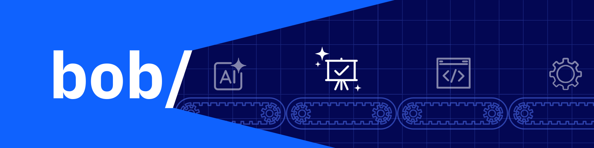

<p align="center">
  
</p>

<h1 align="center">Presentation Factory</h1>
<p align="center"> **O que é?** O Presentation Factory é um framework open source que permite a assistentes de IA gerar apresentações HTML profissionais a partir de um prompt, utilizando templates reutilizáveis, regras de design e assets versionados.
<p align="center">
  <a href="#quick-start">Quick Start</a> ·
  <a href="#estrutura">Estrutura</a> ·
  <a href="#avançado">Avançado</a> ·
  <a href="https://github.com/ce-bsb/presentation-factory/wiki">Docs</a>
</p>

<br>

```
clone  →  abra no Bob  →  peça a apresentação  →  abra o index.html no navegador
```

<br>

## Quick Start

**1 — Git**

Instale o [Git](https://git-scm.com/downloads) e confirme:

```bash
git --version
```

**2 — Clone**

```bash
git clone https://github.com/ce-bsb/presentation-factory.git
```

**3 — Bob**

Crie ou abra uma pasta pai como workspace. O modo *Presentation Factory* é detectado sozinho.

```
[SUA_PASTA]/                   ← abra aqui
└── presentation-factory/
```

**4 — Peça**

> Crie uma apresentação sobre IA generativa para o Banco ABC.

```
[SUA_PASTA]/
├── presentation-factory/
└── abc-ia-generativa/
    ├── index.html          ← abra no navegador
    └── assets/
```

<br>

## Funcionalidades

Um prompt vira uma apresentação HTML completa — responsiva, sobre templates reutilizáveis, seguindo regras de design embutidas e assets versionados.

Feito para o IBM Bob, mas funciona com qualquer assistente de IA com acesso a arquivos locais.

<br>

## Estrutura

```
presentation-factory/
├── clients/<org>/
│   ├── assets/                 logos, CSS, referências
│   ├── templates/              index.html autocontido
│   └── presentations/<slug>/   brief.md + presentation.toml
├── organizations/ibm/          assets e templates IBM
├── catalog/models.toml         aliases de modelos de IA
├── src/presentation_factory/   builder
└── dist/                       saída gerada, não é fonte
```

A apresentação nasce fora da factory, com `index.html` e `assets/` próprios.

<br>

## Avançado

<details>
<summary>Usar o builder pela linha de comando</summary>

<br>

Requer Python 3.11+ e `make`.

```bash
make list
make validate
make test
make build PRESENTATION=<slug> MODEL=primary
```

O resultado fica em `dist/<slug>/primary/workspace/index.html`.

</details>

<br>

---

<p align="center">
  <sub>CE Brasília</sub>
</p>