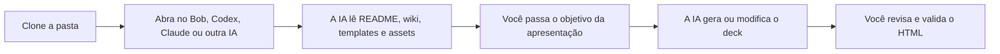
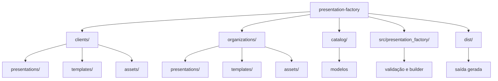

# IBM Presentation Factory

Base de referência para criar apresentações HTML com Bob, Codex, Claude ou
qualquer IA que consiga ler uma pasta local.

O uso principal é simples: clone este repositório, abra a pasta no seu
computador e peça para a IA usar tudo aqui como referência e requisitos para
gerar ou modificar uma apresentação.

## Ideia Principal



## O Que Tem Nesta Pasta

Este repositório reúne os requisitos para uma IA criar apresentações no padrão
do IBM Client Engineering:

- estrutura de pastas para apresentações, templates e assets;
- padrões de cores, fontes, tamanhos e responsividade;
- templates HTML reutilizáveis;
- assets de clientes e IBM;
- exemplos de `brief.md` e `presentation.toml`;
- documentação de como criar, modificar e revisar um deck;
- comandos opcionais para validar e gerar pacotes reproduzíveis.

## 1. Clone Para Seu Computador

Via HTTPS:

```bash
git clone https://github.com/ce-bsb/presentation-factory.git
cd presentation-factory
```

Via SSH:

```bash
git clone git@github.com:ce-bsb/presentation-factory.git
cd presentation-factory
```

Se quiser adaptar antes de contribuir, faça um fork no GitHub e clone a URL do
seu fork.

## 2. Abra a Pasta na IA

Use a ferramenta que preferir:

- Bob
- Codex
- Claude
- Cursor
- VS Code com agente de IA
- outra IA com acesso aos arquivos locais

O importante é a IA conseguir ler a pasta `presentation-factory`.

## 3. Peça Para a IA Usar Como Referência

Use este prompt inicial:

```text
Use esta pasta presentation-factory como base de referência e requisitos para
criar ou modificar uma apresentação HTML.

Antes de alterar qualquer coisa:
- leia o README;
- leia a wiki;
- leia os templates disponíveis;
- leia os assets e CSS existentes;
- siga os padrões de cores, fontes, tamanhos, responsividade, navegação e PDF;
- não invente logos, cores, fontes ou estrutura visual fora do que está aqui;
- mantenha caminhos relativos;
- preserve a separação entre presentations, templates e assets.
```

Depois envie o pedido da apresentação:

```text
Crie uma apresentação para:
- objetivo: <objetivo>;
- público: <público>;
- cliente ou organização: <cliente/organização>;
- mensagens principais: <mensagens>;
- duração esperada: <tempo>;
- materiais de referência: <arquivos, links ou contexto>.
```

## 4. Como Usar Com Bob

Há duas formas recomendadas.

### Opção A: Usar a pasta diretamente

1. Clone o repositório.
2. Abra a pasta `presentation-factory` no ambiente onde o Bob consegue acessar
   arquivos.
3. Peça para o Bob ler a pasta e usar como referência.
4. Passe o objetivo da apresentação.
5. Peça para ele gerar ou modificar os arquivos seguindo os padrões.

Prompt para Bob:

```text
Bob, use a pasta presentation-factory como referência oficial para gerar esta
apresentação.

Leia README, wiki, templates, assets, CSS e exemplos antes de propor mudanças.
Siga os padrões visuais e técnicos documentados. Quando faltar informação,
pergunte ou marque como lacuna. Não invente dados, logos, cores ou fontes.
```

### Opção B: Criar um modo/projeto do Bob

Crie um projeto ou modo chamado, por exemplo, `Presentation Factory`.

Configure as instruções do projeto com este texto:

```text
Você é um assistente para criar e modificar apresentações HTML usando o
Presentation Factory.

Sempre use a pasta presentation-factory como fonte de requisitos:
- README;
- wiki;
- templates;
- assets;
- CSS;
- exemplos de apresentações;
- padrões visuais.

Regras obrigatórias:
- tema sempre claro;
- IBM Plex Sans como fonte principal;
- IBM Plex Mono para código ou conteúdo técnico;
- texto geral com no mínimo 18px;
- layout testado em 1280 x 720;
- responsividade sem texto cortado;
- cores vindas dos assets, CSS ou identidade documentada;
- navegação por teclado e toque;
- impressão em PDF sem controles;
- caminhos relativos;
- sem dados inventados.

Antes de gerar, confirme objetivo, público, cliente, mensagens principais,
materiais de referência e lacunas.
```

Depois, em cada nova solicitação, informe apenas o contexto da apresentação e os
materiais de referência.

## 5. O Que a IA Deve Gerar ou Alterar

Para uma apresentação nova, a IA normalmente deve criar:

```text
clients/<cliente>/presentations/<slug>/
├── brief.md
└── presentation.toml
```

Se precisar de uma estrutura HTML nova, ela deve criar ou adaptar um template:

```text
clients/<cliente>/templates/<template>/
├── index.html
├── README.md
└── assets/
```

Assets reutilizáveis devem ficar em:

```text
clients/<cliente>/assets/
organizations/ibm/assets/
```

## 6. Regras Que a IA Deve Seguir

| Tema | Regra |
|---|---|
| Cores | Usar identidade IBM, identidade do cliente ou tokens CSS existentes |
| Fonte | IBM Plex Sans; IBM Plex Mono para código |
| Tamanho | Texto geral com no mínimo `18px` |
| Tema | Sempre claro |
| Responsividade | Testar principalmente em `1280 x 720` |
| Assets | Não duplicar logos, CSS ou imagens existentes |
| Caminhos | Usar caminhos relativos |
| Dados | Não inventar fatos, números ou nomes |
| PDF | Impressão sem controles de navegação |

## 7. Validação Opcional

Se tiver Python 3.11 ou superior e `make`, rode:

```bash
make list
make validate
make test
```

Para montar um workspace:

```bash
make build PRESENTATION=<slug-da-apresentacao> MODEL=primary
```

Abra o resultado:

```text
dist/<slug-da-apresentacao>/primary/workspace/index.html
```

## Estrutura da Pasta



## Onde Ler Mais

A wiki detalha os padrões e fluxos:

- Primeiro uso
- Usando com Bob ou IA
- Criando uma apresentação
- Templates e assets
- Padrões visuais
- Comandos e automação
- Qualidade e governança

Wiki: https://github.com/ce-bsb/presentation-factory/wiki
