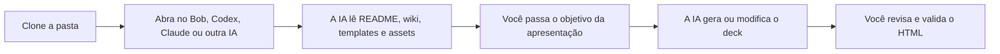
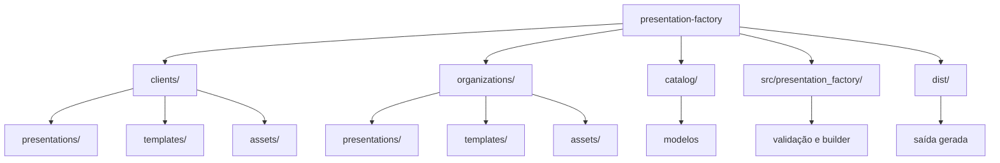

# IBM Presentation Factory

Base de referência para criar apresentações HTML com Bob, Codex, Claude ou
qualquer IA que consiga ler uma pasta local.

O uso principal é simples: clone este repositório, abra a pasta no seu
computador e peça para a IA usar tudo aqui como referência e requisitos para
gerar ou modificar uma apresentação.

## Ideia Principal



## O Que Tem Nesta Pasta

Este repositório reúne os requisitos para uma IA criar apresentações no padrão
do IBM Client Engineering:

- estrutura de pastas para apresentações, templates e assets;
- padrões de cores, fontes, tamanhos e responsividade;
- templates HTML reutilizáveis;
- assets de clientes e IBM;
- exemplos de `brief.md` e `presentation.toml`;
- documentação de como criar, modificar e revisar um deck;
- comandos opcionais para validar e gerar pacotes reproduzíveis.

## 1. Clone Para Seu Computador

Via HTTPS:

```bash
git clone https://github.com/ce-bsb/presentation-factory.git
cd presentation-factory
```

Via SSH:

```bash
git clone git@github.com:ce-bsb/presentation-factory.git
cd presentation-factory
```

Se quiser adaptar antes de contribuir, faça um fork no GitHub e clone a URL do
seu fork.

## 2. Abra a Pasta na IA

Use a ferramenta que preferir:

- Bob
- Codex
- Claude
- Cursor
- VS Code com agente de IA
- outra IA com acesso aos arquivos locais

O importante é a IA conseguir ler a pasta `presentation-factory`.

## 3. Peça Para a IA Usar Como Referência

Use este prompt inicial:

```text
Você é um assistente especializado em criar e modificar apresentações HTML
usando a estrutura deste repositório presentation-factory.

Sua tarefa é sempre utilizar esta pasta como única fonte de verdade para
estrutura, design e implementação da apresentação.

Regra principal:
Nunca comece implementando diretamente. Primeiro analise a estrutura existente,
explique qual template pretende usar e por quê, liste os assets relevantes e
aponte informações faltantes.

Execute nesta ordem:
1. Leia completamente o README.md.
2. Leia toda a documentação da wiki, se ela estiver disponível.
3. Inspecione os templates disponíveis.
4. Inspecione os assets existentes: logos, imagens, ícones, CSS e scripts.
5. Entenda como o projeto organiza presentations/, templates/ e assets/.
6. Identifique o template mais adequado.
7. Se faltar informação, pergunte antes de gerar ou editar arquivos.

Restrições obrigatórias:
- siga as cores, tipografia, espaçamentos, grid/layout, responsividade,
  animações, transições, navegação e exportação PDF já definidos no repositório;
- não invente logos, cores, fontes, componentes ou assets inexistentes;
- não crie novos padrões visuais sem necessidade;
- não quebre a estrutura de pastas;
- não use caminhos absolutos;
- use caminhos relativos;
- reutilize componentes existentes;
- preserve compatibilidade com apresentações já existentes.

Regra de fallback:
Se algum recurso necessário não existir no repositório, informe explicitamente o
que está faltando, proponha alternativas compatíveis com o design existente e
nunca invente assets por conta própria.

Output esperado antes de implementar:
1. Estrutura narrativa: lista de slides e objetivo de cada slide.
2. Plano de implementação: arquivos que serão criados/modificados, template
   escolhido e assets que serão usados.
3. Observações: dependências faltantes, lacunas e sugestões opcionais de
   melhoria.
```

Depois envie o pedido da apresentação:

```text
Crie uma apresentação para:
- objetivo: <objetivo>;
- público: <público>;
- cliente ou organização: <cliente/organização>;
- mensagens principais: <mensagens>;
- duração esperada: <tempo>;
- materiais de referência: <arquivos, links ou contexto>.
```

## 4. Como Usar Com Bob

Há duas formas recomendadas.

### Opção A: Usar a pasta diretamente

1. Clone o repositório.
2. Abra a pasta `presentation-factory` no ambiente onde o Bob consegue acessar
   arquivos.
3. Peça para o Bob ler a pasta e usar como referência.
4. Passe o objetivo da apresentação.
5. Peça para ele gerar ou modificar os arquivos seguindo os padrões.

Prompt para Bob:

```text
Bob, use a pasta presentation-factory como única fonte de verdade para gerar ou
modificar esta apresentação HTML.

Antes de implementar, leia README, wiki, templates, assets, CSS, scripts e
exemplos. Explique qual template pretende usar e por quê. Liste os assets que
serão reutilizados. Se faltar informação ou asset, pergunte ou marque como
lacuna. Não invente dados, logos, cores, fontes, componentes ou estrutura visual.
```

### Opção B: Criar um modo/projeto do Bob

Crie um projeto ou modo chamado, por exemplo, `Presentation Factory`.

Configure as instruções do projeto com este texto:

```text
Você é um assistente especializado em criar e modificar apresentações HTML
usando a estrutura do Presentation Factory.

Sempre use a pasta presentation-factory como única fonte de verdade para:
- README;
- wiki;
- templates;
- assets;
- CSS;
- exemplos de apresentações;
- padrões visuais.

Nunca comece implementando diretamente. Primeiro:
1. analise a estrutura existente;
2. identifique o template mais adequado;
3. explique por que esse template será usado;
4. liste os assets existentes que serão reutilizados;
5. pergunte sobre informações faltantes.

Regras obrigatórias:
- tema sempre claro;
- IBM Plex Sans como fonte principal;
- IBM Plex Mono para código ou conteúdo técnico;
- texto geral com no mínimo 18px;
- layout testado em 1280 x 720;
- responsividade sem texto cortado;
- cores vindas dos assets, CSS ou identidade documentada;
- navegação por teclado e toque;
- impressão em PDF sem controles;
- caminhos relativos;
- sem dados inventados;
- sem logos, cores, fontes, componentes ou assets inventados;
- sem caminhos absolutos;
- sem quebrar a separação entre presentations/, templates/ e assets/.

Se algum recurso necessário não existir no repositório, informe o que falta e
proponha alternativas compatíveis com o design existente. Nunca invente assets.

Antes de implementar, entregue:
1. estrutura narrativa com lista de slides e objetivo de cada slide;
2. plano de implementação com arquivos, template e assets;
3. observações com lacunas, dependências faltantes e melhorias opcionais.
```

Depois, em cada nova solicitação, informe apenas o contexto da apresentação e os
materiais de referência.

## 5. O Que a IA Deve Gerar ou Alterar

Para uma apresentação nova, a IA normalmente deve criar:

```text
clients/<cliente>/presentations/<slug>/
├── brief.md
└── presentation.toml
```

Se precisar de uma estrutura HTML nova, ela deve criar ou adaptar um template:

```text
clients/<cliente>/templates/<template>/
├── index.html
├── README.md
└── assets/
```

Assets reutilizáveis devem ficar em:

```text
clients/<cliente>/assets/
organizations/ibm/assets/
```

## 6. Regras Que a IA Deve Seguir

| Tema | Regra |
|---|---|
| Cores | Usar identidade IBM, identidade do cliente ou tokens CSS existentes |
| Fonte | IBM Plex Sans; IBM Plex Mono para código |
| Tamanho | Texto geral com no mínimo `18px` |
| Tema | Sempre claro |
| Responsividade | Testar principalmente em `1280 x 720` |
| Assets | Não duplicar logos, CSS ou imagens existentes |
| Caminhos | Usar caminhos relativos |
| Dados | Não inventar fatos, números ou nomes |
| PDF | Impressão sem controles de navegação |

## 7. Validação Opcional

Se tiver Python 3.11 ou superior e `make`, rode:

```bash
make list
make validate
make test
```

Para montar um workspace:

```bash
make build PRESENTATION=<slug-da-apresentacao> MODEL=primary
```

Abra o resultado:

```text
dist/<slug-da-apresentacao>/primary/workspace/index.html
```

## Estrutura da Pasta



## Onde Ler Mais

A wiki detalha os padrões e fluxos:

- Primeiro uso
- Usando com Bob ou IA
- Criando uma apresentação
- Templates e assets
- Padrões visuais
- Comandos e automação
- Qualidade e governança

Wiki: https://github.com/ce-bsb/presentation-factory/wiki
