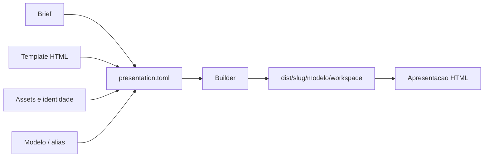
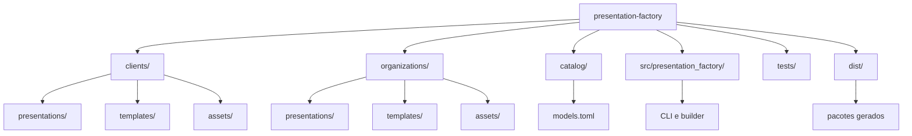
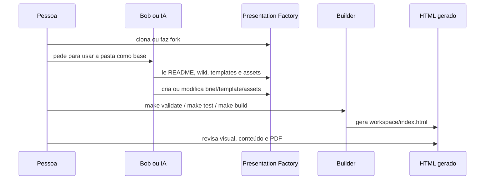

# IBM Presentation Factory

Base para criar, padronizar e reutilizar apresentações HTML no IBM Client
Engineering.

Use este repositório para clonar uma referência local, entregar a pasta para Bob
ou outra IA, e pedir que uma apresentação seja gerada ou modificada seguindo os
padrões de estrutura, cores, fontes, responsividade, assets e governança.

## Em uma frase

O Presentation Factory transforma brief, template, assets e regras visuais em um
workspace autocontido para gerar apresentações HTML consistentes.



## Para Que Serve

- Dar uma base comum para Bob ou qualquer IA criar apresentações.
- Evitar decks soltos em pastas locais sem padrão.
- Reutilizar templates, logos, CSS, imagens e prompts.
- Manter cores, fontes, tamanhos e responsividade documentados.
- Gerar um pacote reproduzível que qualquer pessoa do time consiga abrir.

## Como Usar

### 1. Clone o repositório

```bash
git clone https://github.com/ce-bsb/presentation-factory.git
cd presentation-factory
```

Ou via SSH:

```bash
git clone git@github.com:ce-bsb/presentation-factory.git
cd presentation-factory
```

Faça um fork se quiser trabalhar em uma cópia própria antes de abrir pull
request.

### 2. Valide o ambiente

Requisitos:

- Git
- Python 3.11 ou superior
- `make`

```bash
git --version
python3 --version
make --version
```

Depois rode:

```bash
make list
make validate
make test
```

### 3. Gere uma apresentação

```bash
make build PRESENTATION=<slug-da-apresentacao> MODEL=primary
```

O resultado fica em:

```text
dist/<slug-da-apresentacao>/primary/
├── brief.md
├── manifest.json
├── prompt.md
└── workspace/
    └── index.html
```

Abra no navegador:

```text
dist/<slug-da-apresentacao>/primary/workspace/index.html
```

## Usando Com Bob ou IA

Depois de clonar, peça para a IA usar esta pasta como base.

```text
Use esta pasta presentation-factory como referência.

Leia o README, a wiki, os templates, os assets e os padrões visuais.
Gere ou modifique a apresentação seguindo os padrões do repositório.
Não invente cores, fontes, tamanhos, logos ou estruturas fora do que está
documentado.
```

Informe também:

- objetivo da apresentação;
- público;
- cliente ou organização;
- mensagens principais;
- duração esperada;
- materiais de referência.

## Estrutura Visual



## Onde Colocar Cada Coisa

| Item | Onde fica |
|---|---|
| Brief da apresentação | `clients/<cliente>/presentations/<slug>/brief.md` |
| Manifesto | `clients/<cliente>/presentations/<slug>/presentation.toml` |
| Template HTML | `clients/<cliente>/templates/<template>/` |
| Assets do cliente | `clients/<cliente>/assets/` |
| Assets IBM | `organizations/ibm/assets/` |
| Modelos disponíveis | `catalog/models.toml` |
| Pacote gerado | `dist/<slug>/<modelo>/` |

## Fluxo de Trabalho



## Padrões Essenciais

- Tema sempre claro.
- Fonte principal: IBM Plex Sans.
- Fonte técnica: IBM Plex Mono.
- Texto geral com no mínimo `18px`.
- Referência principal de teste: `1280 x 720`.
- Layout responsivo, sem texto cortado.
- Cores vindas da identidade IBM, do cliente ou dos tokens existentes.
- Navegação por teclado, toque, índice e impressão em PDF.
- Nada de caminhos absolutos da máquina local.

## Exemplo de Manifesto

```toml
name = "Nome da apresentação"
template = "clients/<cliente>/templates/<template>"
brief = "clients/<cliente>/presentations/<slug>/brief.md"
default_model = "primary"

[assets]
"assets/brand/styles.css" = "clients/<cliente>/assets/css/styles.css"
"assets/brand/logo.svg" = "clients/<cliente>/assets/img/logo.svg"
"assets/partner/logo-light.svg" = "organizations/ibm/assets/img/logo-light.svg"
```

## Comandos Úteis

```bash
make list
make validate
make test
make build PRESENTATION=<slug-da-apresentacao> MODEL=primary
```

Uso direto da CLI:

```bash
PYTHONPATH=src python3 -m presentation_factory build \
  <slug-da-apresentacao> \
  --model alternate
```

## Documentação Completa

A wiki detalha como usar, criar e modificar apresentações:

- Primeiro uso
- Usando com Bob ou IA
- Criando uma apresentação
- Templates e assets
- Padrões visuais
- Comandos e automação
- Qualidade e governança

Wiki: https://github.com/ce-bsb/presentation-factory/wiki

## GitHub Actions

O workflow valida pushes e pull requests. Na execução manual, ele recebe
apresentação e modelo, monta o pacote e publica `dist/<slug>/<modelo>` como
artifact.
