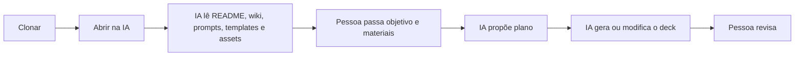

# IBM Presentation Factory

Pasta de referência para criar apresentações HTML com Bob, Codex, Claude,
Cursor ou qualquer IA que consiga ler arquivos locais.

O uso principal é: clonar o repositório, abrir a pasta na IA e pedir que ela use
os templates, assets, padrões e prompts daqui como requisitos.



## Como Usar

```bash
git clone https://github.com/ce-bsb/presentation-factory.git
cd presentation-factory
```

Abra a pasta em Bob, Codex, Claude, Cursor ou outro agente.

Leia primeiro:

- [AGENTS.md](AGENTS.md)
- [QUICKSTART.md](QUICKSTART.md)
- [prompts/presentation-generation.md](prompts/presentation-generation.md)

Se a IA não acessa links externos, clone a wiki ao lado do repositório:

```bash
git clone https://github.com/ce-bsb/presentation-factory.wiki.git
```

## Estrutura

```text
presentation-factory/
├── README.md
├── prompts/                 # prompts-base para IA
├── clients/                 # clientes, assets, templates e apresentações
├── organizations/           # IBM, design systems e materiais corporativos
├── catalog/                 # aliases de modelos
├── src/presentation_factory/ # validação e builder
├── tests/
└── dist/                    # saída gerada, não é fonte
```

## Onde Colocar Cada Coisa

| Item | Local |
|---|---|
| Conteúdo da apresentação | `clients/<cliente>/presentations/<slug>/brief.md` |
| Manifesto | `clients/<cliente>/presentations/<slug>/presentation.toml` |
| Template HTML | `clients/<cliente>/templates/<template>/` |
| Logos, CSS e imagens | `clients/<cliente>/assets/` ou `organizations/ibm/assets/` |
| Prompt-base | `prompts/` |
| Código do builder | `src/presentation_factory/` |
| Saída gerada | `dist/` |

## Regras Essenciais

- A IA deve analisar antes de implementar.
- Não inventar logos, cores, fontes, componentes, dados ou assets.
- Usar caminhos relativos.
- Reutilizar templates e assets existentes.
- Manter tema claro e texto geral com pelo menos `18px`.
- Não tratar `dist/` como fonte.

## Validação Opcional

Requer Python 3.11+ e `make`.

```bash
make list
make validate
make test
make build PRESENTATION=<slug-da-apresentacao> MODEL=primary
```

Abra:

```text
dist/<slug-da-apresentacao>/primary/workspace/index.html
```

## Wiki

Documentação completa:

https://github.com/ce-bsb/presentation-factory/wiki
